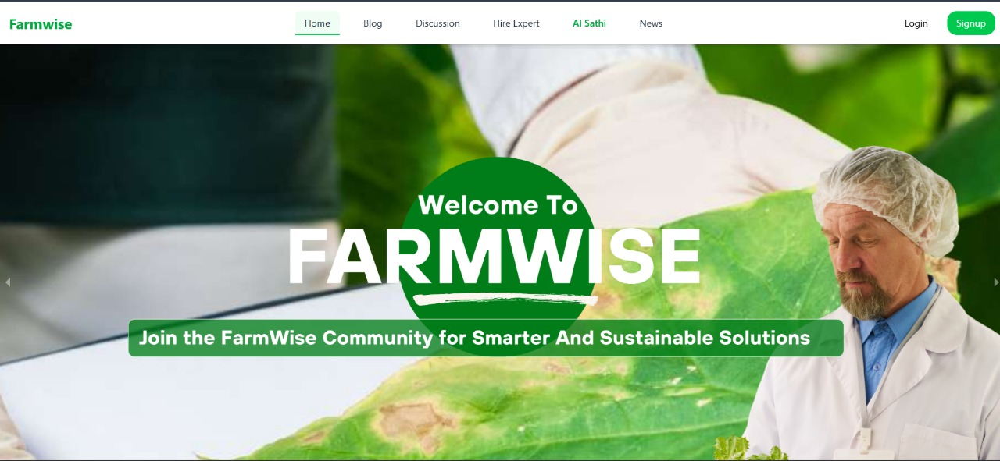
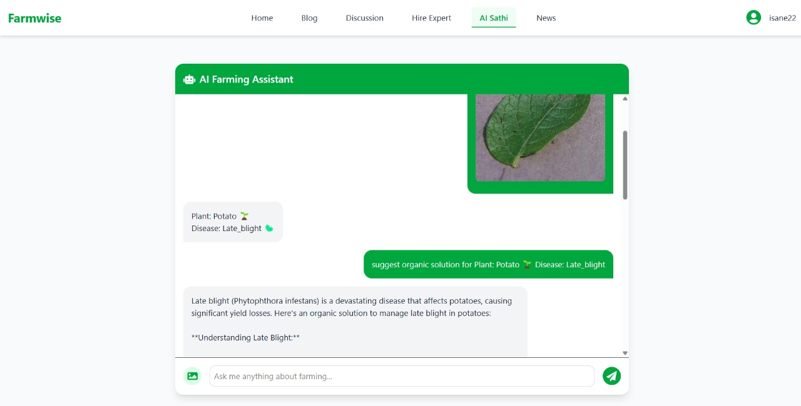
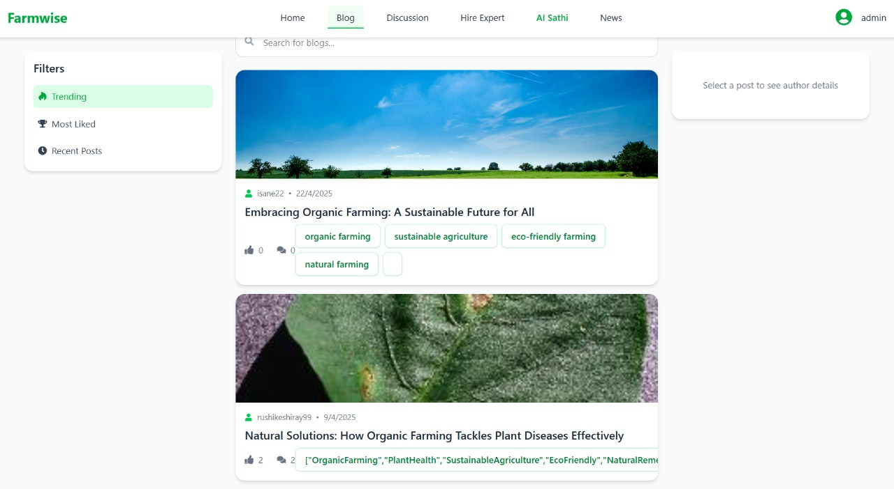
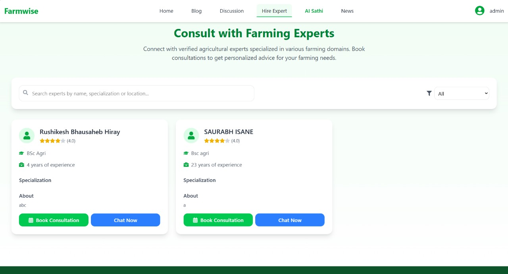
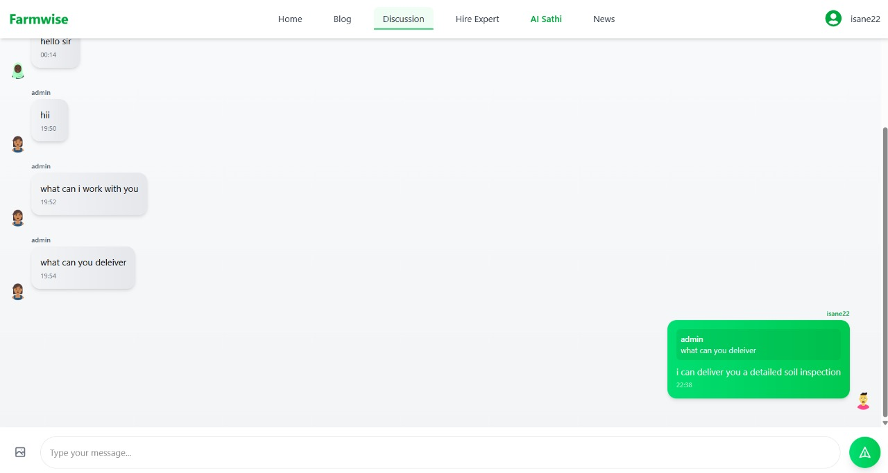

<div align="center">
  
  
  # 🌾 FarmWise
  
  <p align="center">
    <b>Bridging agricultural knowledge gaps through technology</b>
  </p>
  
  <p align="center">
    <a href="#features"></a>
    <a href="#installation"></a>
    <a href="#technology-stack"></a>
    <a href="#license"></a>
  </p>
</div>

## 📋 Overview

**FarmWise** transforms agricultural collaboration by connecting **farmers**, **experts**, and **administrators** in a dynamic digital ecosystem. Our platform offers a comprehensive suite of tools designed to foster knowledge sharing, problem-solving, and community building within the agricultural sector.

<div align="center">
  <table>
    <tr>
      <td align="center"><b>🧑‍🌾 For Farmers</b></td>
      <td align="center"><b>👨‍🔬 For Experts</b></td>
      <td align="center"><b>👨‍💼 For Administrators</b></td>
    </tr>
    <tr>
      <td>Access expert advice when you need it most</td>
      <td>Share your knowledge with a community that values it</td>
      <td>Maintain a thriving, supportive ecosystem</td>
    </tr>
  </table>
</div>

## ✨ Platform Highlights

<div align="center">
  
  <p><i>AI Sathi Dashboard - Your intelligent farming assistant</i></p>
</div>

<div style="display: flex; justify-content: space-between; flex-wrap: wrap;">
  <div style="flex: 1; min-width: 300px; margin: 10px;">
    
    <p align="center"><i>Knowledge Sharing Blog Interface</i></p>
  </div>
  <div style="flex: 1; min-width: 300px; margin: 10px;">
    
    <p align="center"><i>Connect with Agricultural Experts</i></p>
  </div>
  <div style="flex: 1; min-width: 300px; margin: 10px;">
    
    <p align="center"><i>Community Discussion Forum</i></p>
  </div>
</div>

## 🚀 Features

### 👨‍🌾 For Farmers
- **Personalized Profiles** - Customize your profile with farm-specific information
- **Knowledge Sharing** - Post blogs about farming experiences and best practices
- **Community Support** - Ask questions in discussion forums and get answers from peers
- **Expert Access** - Connect directly with agricultural specialists
- **Smart Farming** - Leverage AI tools for improved decision-making

### 👩‍🔬 For Experts
- **Professional Showcase** - Highlight your expertise and credentials
- **Knowledge Distribution** - Share insights through blogs and discussions
- **Direct Impact** - Answer farmers' questions and provide targeted feedback
- **Community Building** - Foster connections within the agricultural ecosystem
- **Consultancy Opportunities** - Offer paid services to farmers needing specialized help

### 👨‍💼 For Administrators
- **Comprehensive Dashboard** - Monitor all platform activities from a central interface
- **User Management** - Maintain user accounts and resolve access issues
- **Content Oversight** - Ensure quality and appropriateness of all shared content
- **System Analytics** - Generate reports on platform usage and engagement
- **Configuration Control** - Adjust system settings for optimal performance

## 💻 System Architecture

FarmWise leverages the power of the **MERN stack** (MongoDB, Express.js, React.js, Node.js) to deliver a seamless user experience across devices.

<div align="center">
  <table>
    <tr>
      <th colspan="2" align="center">Core Components</th>
    </tr>
    <tr>
      <td align="center">🔐 <b>Authentication System</b></td>
      <td>Secure user registration, login, and profile management</td>
    </tr>
    <tr>
      <td align="center">📝 <b>Blog Platform</b></td>
      <td>Rich text editing with comments and social sharing</td>
    </tr>
    <tr>
      <td align="center">💬 <b>Discussion Forum</b></td>
      <td>Topic-based threads with nested replies and reactions</td>
    </tr>
    <tr>
      <td align="center">📨 <b>Messaging System</b></td>
      <td>Real-time communication with notifications</td>
    </tr>
    <tr>
      <td align="center">🛠️ <b>Admin Panel</b></td>
      <td>Comprehensive tools for platform management</td>
    </tr>
  </table>
</div>

## 🛠️ Technology Stack

<div align="center">
  <table>
    <tr>
      <th>Layer</th>
      <th>Technologies</th>
    </tr>
    <tr>
      <td><b>Frontend</b></td>
      <td>
        
        
        
      </td>
    </tr>
    <tr>
      <td><b>Backend</b></td>
      <td>
        
        
        
      </td>
    </tr>
    <tr>
      <td><b>Database</b></td>
      <td>
        
        
      </td>
    </tr>
    <tr>
      <td><b>DevOps</b></td>
      <td>
        
        
      </td>
    </tr>
  </table>
</div>

## 📋 Installation

### Prerequisites
- Node.js (v14.x or higher)
- MongoDB (v4.x or higher)
- npm (v6.x or higher)

### Quick Start Guide

1. **Clone the repository**
   ```bash
   git clone https://github.com/Rushi992145/FarmWise.git && cd FarmWise
   ```

2. **Install dependencies**
   ```bash
   # Backend dependencies
   npm install
   
   # Frontend dependencies
   cd client && npm install && cd ..
   ```

3. **Configure environment**
   ```bash
   cp .env.example .env
   # Edit .env with your configuration details
   ```

4. **Start development servers**
   ```bash
   # Run both frontend and backend concurrently
   npm run dev
   ```

5. **Access the application**
   - Backend API: http://localhost:5000
   - Frontend: http://localhost:3000

## 🔧 Configuration Options

```bash
# Server Configuration
PORT=5000
NODE_ENV=development

# MongoDB Connection
MONGO_URI=mongodb://localhost:27017/farmwise

# Authentication
JWT_SECRET=your_jwt_secret_key
JWT_EXPIRE=30d

# Email Configuration
EMAIL_SERVICE=gmail
EMAIL_USERNAME=your_email@gmail.com
EMAIL_PASSWORD=your_email_password

# Cloud Storage
CLOUDINARY_CLOUD_NAME=your_cloud_name
CLOUDINARY_API_KEY=your_api_key
CLOUDINARY_API_SECRET=your_api_secret
```

## 👥 Contributing

We welcome contributions from developers, farmers, agricultural experts, and enthusiasts! Please follow these steps:

1. Fork the repository
2. Create your feature branch (`git checkout -b feature/amazing-feature`)
3. Commit your changes (`git commit -m 'Add some amazing feature'`)
4. Push to the branch (`git push origin feature/amazing-feature`)
5. Open a Pull Request.

<div align="center">
  <p>Together, we can revolutionize agricultural knowledge sharing!</p>
</div>

## 📄 License

This project is licensed under the MIT License - see the LICENSE file for details.

## 📞 Contact & Support

- **Project Link**: [https://github.com/Rushi992145/FarmWise](https://github.com/Rushi992145/FarmWise)
- **Report Issues**: [Issue Tracker](https://github.com/Rushi992145/FarmWise/issues)

---

<div align="center">
  <p>🌱 <b>Cultivating Knowledge, Growing Together</b> 🌱</p>
</div>
